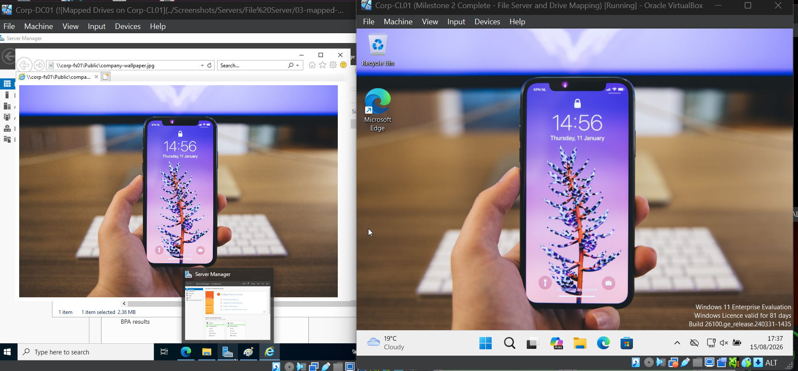

# Group Policy

## Overview

Group Policy is used to centrally manage and configure users and computers in the `corp.internal` domain.

Group Policy Objects (GPOs) are linked to Organizational Units (OUs) to apply settings to specific users or computers.

---

# GPO - Company Desktop

## Purpose

This GPO configures a standard company desktop wallpaper for users in the `Company Users` Organizational Unit.

## GPO Configuration

**GPO Name:** `GPO - Company Desktop`

**Linked to:** `Company Users`

### Policy Path

```text
User Configuration
└── Policies
    └── Administrative Templates
        └── Desktop
            └── Desktop
                └── Desktop Wallpaper
```

### Configuration

| Setting | Value |
|---|---|
| Policy | Desktop Wallpaper |
| State | Enabled |
| Wallpaper Path | `\\Corp-FS01\Public\company-wallpaper.jpg` |
| Wallpaper Style | Fill |

> Replace `company-wallpaper.jpg` above with the exact filename if your actual wallpaper has a different name or extension.

## Testing

The policy was tested on `Corp-CL01` using the `CORP\jsmith` account.

Group Policy was refreshed using:

```cmd
gpupdate /force
```

The wallpaper did not apply immediately, but applied successfully after signing out and signing back in.

This confirmed that the `GPO - Company Desktop` policy was successfully applied to the user.

### Verification Screenshot


